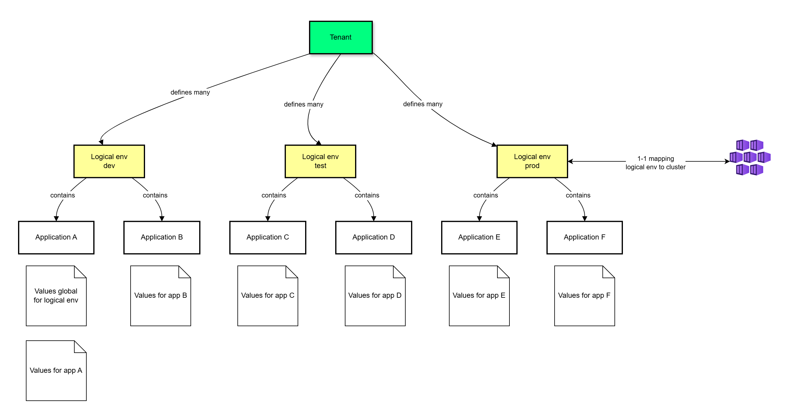

# Kubeit Complex example

Demonstrate to deploy applications as tenant's example repo:

* allows to define logical environments and map each logical env into one KubeIT cluster
* defines logical environment as set of applications
* use KubeIT helm charts to manage all configurations
* keep flat branching strategy, all logical environments and applications configurations are managed via `main` branch

# Repository structure

```
.
├── README.md
├── bootstrap                                      # Bootstrap helm chart for all logical environments to be deployed on KubeIT
│   ├── Chart.yaml                                 # Defines `dependencies` chart for kubeit-logical-envs
│   └── values.yaml                                # Defines all logical environments and their mapping to KubeIT clusters
│                                                  # Optionally, defines which helm chart to use to deploy apps in logical environment `appLogicalEnvChart`
├── dev                                            # Logical environments for `dev` KubeIT clusters
│   ├── dev-eus2-blue                              # Folder as name of logical environment
│   │   ├── _apps.yaml                             # List of applications within logical env `dev-eus2-blue`
│   │   ├── global.yaml                            # Global values re-used for all applications within logical env
│   │   ├── onegateway-redis.yaml                  # Values for onegateway-redis application
│   │   ├── onegateway-reverseproxy-workload.yaml  # Values for onegateway-reverseproxy-workload application
│   │   ├── onegateway-secrets.yaml                # Values for onegateway-sessionmanager application
│   │   ├── onegateway-sessionmanager.yaml         # Values for onegateway-sessionmanager application
│   │   ├── onegateway-workload.yaml               # Values for onegateway-workload application
│   │   ├── standard-workload.yaml                 # Values for standard-workload application
│   │   ├── win-api-workload.yaml                  # Values for win-api-workload application
│   │   └── win-standard-workload.yaml             # Values for win-standard-workload application
│   ├── dev-eus2-green                             # Folder as name of logical environment
│   │   ├── _apps.yaml                             # List of applications within logical env `dev-eus2-green`
│   │   ├── global.yaml                            # Global values re-used for all applications within logical env
│   │   ├── <app1 name>.yaml
│   │   ├── <app2 name>.yaml
│   │   └── <app3 name>.yaml
│   ├── <logical env name>                         # Folder as name of logical environment
│   │   ├── _apps.yaml
│   │   └── global.yaml
├── nonprod                                        # Logical environments for `nonprod` KubeIT clusters
├── prod                                           # Logical environments for `prod` KubeIT clusters
```

# Logical environments

Tenant can define logical environments.

Logical environment respresents set of applications that are deployed together and be tested together, e.g. development version, UAT version, production version.

Logical environment is mapped to one KubeIT cluster only.

Application config (values) is mapped 1-1 with logical environment.



```yaml
# bootstrap/values.yaml
# optional, app-in-logical-env chart to use to generate application within one logical env
# appLogicalEnvChart:
#   repoURL: https://dnv-gssit.github.io/kubeit-charts
#   chart: kubeit-apps-in-env
#   targetRevision: 0.0.12

# List of logical environments on KubeIT dev clusters
#
dev:                        # KubeIT dev cluster target
  - name: dev-we-green      # Name of logical environment
    shortRegion: we         # KubeIT region of cluster to deploy
    clusterColour: green    # KubeIT color of cluster to deploy
  - name: dev-we-blue
    shortRegion: we
    clusterColour: blue
  - name: dev-eus2-blue
    shortRegion: eus2
    clusterColour: blue
  - name: dev-eus2-green
    shortRegion: eus2
    clusterColour: green
  - name: dev-sea-blue
    shortRegion: sea
    clusterColour: blue
  - name: dev-sea-green
    shortRegion: sea
    clusterColour: green

# List of logical environments on KubeIT nonprod clusters
nonprod: {}

# List of logical environments on KubeIT prod clusters
prod: {}
```

# Applications within logical environments

To define applications within logical environments,
`<KubeIT env>/<logical env>` folder structure should be created, example: `dev/dev-we-green`

`<KubeIT env>` names are `nonprod` or `prod`. For KubeIT internal testing `dev` could be defined as well.

Create file `_apps.yaml` under folder:

```yaml
# <KubeIT env>/<logical env>/_apps.yaml
# List of applications within logical environment
applications:
  - name: <application name>     # max 30 chars alphanumeric
    namespace: <namespace>       # namespace to deploy application
    useArgoCDimageUpdater: false # use argoCD image updater
    # optionally image if image updater is used
    image:
      # image name
      name: <image name>          # registry/repository/image
      # image tag
      tag: <image tag>            # image tag
    # optionally service helm chart could be defined
    serviceChart:
      repoURL: https://dnv-gssit.github.io/kubeit-charts
      targetRevision: 1.2.0
      # chart: helm chart name on helm repository
      chart: kubeit-deployment-chart
      # path: folder on the gitops repository defined as repoURL
```

Application by default would use service chart defined and maintained by KubeIT team.
If application has its own chart, it should be defined in `serviceChart` section.

Example:

```yaml
# dev/dev-we-green/_apps.yaml
---
applications:
  - name: standard-workload
    namespace: standard-test
    useArgoCDimageUpdater: false

  - name: onegateway-workload
    namespace: onegateway
    useArgoCDimageUpdater: false

  - name: onegateway-sessionmanager
    namespace: onegateway
    useArgoCDimageUpdater: false

  - name: onegateway-redis
    namespace: onegateway
    serviceChart:
      chart: kubeit-redis-chart
      targetRevision: 0.1.3
    useArgoCDimageUpdater: false
```

# Application values

To defined values for applications,
`<KubeIT env>/<logical env>` folder structure should be created, example: `dev/dev-we-green`

Create file with name of application name: `<app_name>.yaml`, example: `standard-workload.yaml`.

Example values:

```yaml
# values to helm chart
redis:
  fullnameOverride: "onegateway-redis"
  master:
    persistence:
      enabled: false
    resources:
      requests:
        cpu: 100m
        memory: 128Mi
      limits:
        cpu: 200m
        memory: 256Mi
  sysctl:
    resources:
      requests:
        cpu: 100m
        memory: 128Mi
      limits:
        cpu: 200m
        memory: 256Mi
```

Order of rendering values for application:

```
# <KubeIT env>/<logical env>/global.yaml     # Global values for all applications within logical environment
# <KubeIT env>/<logical env>/<app_name>.yaml # Values for <app_name> within logical environment
```
**Note:** for list, the values are overriden by the last definition in sequence and do not merged.

# Actions

**Add new logical environment**

1. Update `bootstrap/values.yaml` with new logical environment and its mapping to KubeIT cluster
2. Create folder structure under `<KubeIT env>/<logical env>` folder for new logical environment
3. Add new file `_apps.yaml` under folder `<KubeIT env>/<logical env>` with list of applications to deploy
4. Add new files for each `<app_name>.yaml` under folder `<KubeIT env>/<logical env>`

**Add new application to logical environment**

1. Update file `<KubeIT env>/<logical env>/_apps.yaml` to add new application
2. Add new file `<app_name>.yaml` under folder `<KubeIT env>/<logical env>`

**Bump helm chart for deploying logical environments**

1. Update `bootstrap/Chart.yaml` with new logical environment and its mapping to KubeIT clusters.

```yaml
dependencies:
- name: kubeit-logical-envs
  version: 0.0.6 # new chart version
  repository: https://dnv-gssit.github.io/kubeit-charts
```

**Bump helm chart for apps within logical environment**

1. Update `bootstrap/values.yaml.

```yaml
# optionally, it is defined in kubeit-logical-envs chart
appLogicalEnvChart:
  repoURL: https://dnv-gssit.github.io/kubeit-charts
  chart: kubeit-apps-in-env
  targetRevision: 0.0.10 # new chart version for deploying apps within logical environment
```

# Restrictions

1. Logical environment can be mapped to one KubeIT cluster only. Otherwise, it would be not possible to define values for applications
per blue / green colour or different KubeIT regions or environments - too complex structure and error prone.

2. To remove application from logical environment, it should be removed from `<KubeIT env>/<logical env>/_apps.yaml` file.

# Promote application between logical environments

Applications can be promoted between logical environments to finally be deployed as production service.
Values of application can be copied between logical environments.

The best practice is to use specific **image tag** for each logical environment, for example:
`stable-dev`, `stable-test`, `stable-uat`, `stable-prod`.

Promotion means to re-tag from one logical environment to another e.g. `stable-dev` (or any fixed tag which passed tests)
is promoted to `stable-uat` tag on ACR.

From configuration perspective, it means `_apps.yaml` should refer to specific tag.

Example usage of ArgoCD image updater for automatic update one new tag `stable-dev` is pushed to ACR:

```yaml
dev/dev-stable/_apps.yaml
applications:
  - name: example
    namespace: namespace-dev
    useArgoCDimageUpdater: true
    image:
      # image name
      name: myacr.acr.io/repo/service
      # image tag
      tag: stable-dev
```

Use promoted image in UAT for application:

```yaml
dev/uat-stable/_apps.yaml
applications:
  - name: example
    namespace: namespace-dev
    useArgoCDimageUpdater: true
    image:
      # image name
      name: myacr.acr.io/repo/service
      # image tag
      tag: stable-uat
```

# Migration between KubeIT clusters

1. Create new logical environments as copy of existing logical environments and point to new KubeIT colour cluster.
2. Update values for new logical environments if they should be different from existing logical environments
e.g. implement breaking changes for new KubeIT release.

# Development environment

1. IDE for coding: Eclipse or Visual Studio Code

2. git

3. [pre-commit](https://pre-commit.com/)

# Testing helm charts

1. Test logical envs chart

```bash
helm repo add kubeit-charts https://dnv-gssit.github.io/kubeit-charts
helm repo update
cd <this_repository>/chart
helm dependency update
# update test-logical-envs.yaml
helm tempate -f ../tests/test-logical-envs.yaml . --debug
```

2. Test apps in logical env chart

```bash
helm repo add kubeit-charts https://dnv-gssit.github.io/kubeit-charts
helm repo update
cd <this_repository>/tests
# version should match `global.appLogicalEnvChart.targetRevision` in `chart/values.yaml`
helm fetch --untar kubeit-charts/kubeit-apps-in-env --version 0.0.12
# test exact logical env
# update test-apps-in-env.yaml
helm template -f test-apps-in-env.yaml -f ../envs/team1/dev-we-blue.yaml kubeit-apps-in-env
```

3. Test service chart

```bash
helm repo add kubeit https://dnv-gssit.github.io/kubeit-charts
helm repo update
cd <this_repository>/tests
# fetch helm chart used to deploy application
helm fetch --untar kubeit-charts/kubeit-deployment-chart --version 1.2.0
# test exact service helm chart
# update test-service.yaml
# add values by -f <file> as produced by `apps in logical` env chart above
helm template -f test-service.yaml -f ../appValues/win-api-workload/global.yaml kubeit-deployment-chart
```

# References:

1. [KubeIT docs](https://docs.kubeit.dnv.com)

2. https://github.com/argoproj/argocd-example-apps
